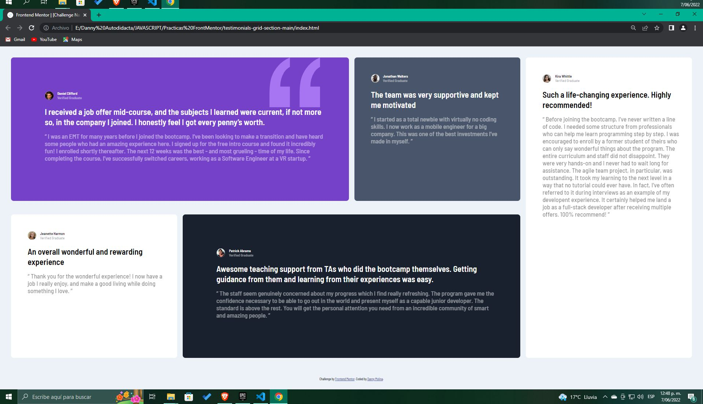

# Frontend Mentor - Testimonial Grid Section Solution

This is a solution to [Frontend Mentor testimonials grid section challenge] (https://www.frontendmentor.io/challenges/testimonials-grid-section-Nnw6J7Un7). Frontend Mentor challenges help you improve your coding skills by creating realistic projects.

## Table of Contents

-[Summary](#summary)
  - [The challenge](#the-challenge)
  - [Screenshot](#screenshot)
  - [Links](#links)
- [Myprocess](#my-process)
  - [Built with](#built with)
  - [What I learned](#what-I-learned)
  - [Continuous development](#continuous-development)
  - [Useful resources](#useful-resources)
- [Author](#author)
- [Thanks](#thanks)

##Overview

### The challenge

Users must be able to:

- See the optimal layout for the site based on the screen size of your device

###Screenshot

### Links

- Solution URL: (https://github.com/DannyMolina/testimonials-grid-section-main)
- Live Site URL: (https://testimonials-grid-select.netlify.app/)

## my process
In this process it was very difficult for me to be able to accommodate the containers to the necessary size and their text
### Built with

- Semantic HTML5 markup
- CSS custom properties
-Flexible box
- CSS Grid
- Mobile first workflow

### What I learned

I was very used to working only with flex-box in this I started to apply more the grid is a good practice I will continue working on grid layout

### Continue development

I would like to continue learning the fact of adjusting the content in the divs to the necessary size

### Useful Resources

##Author

- Website - (https://github.com/DannyMolina/testimonials-grid-section-main)
- Frontend Mentor - [@DannyMolina]

## Thanks

Thanks to my tireless anxiety that drives me crazy when it comes to becoming a frontend